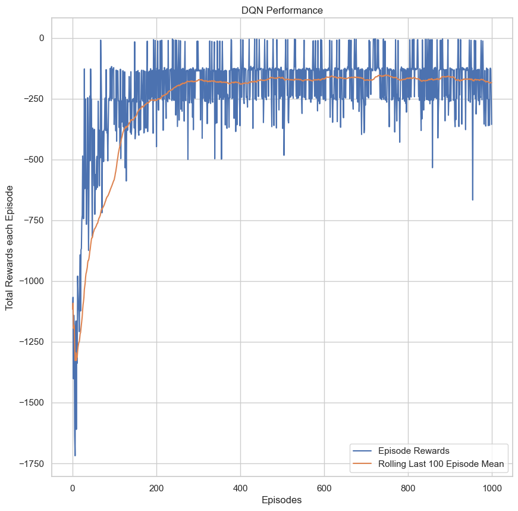
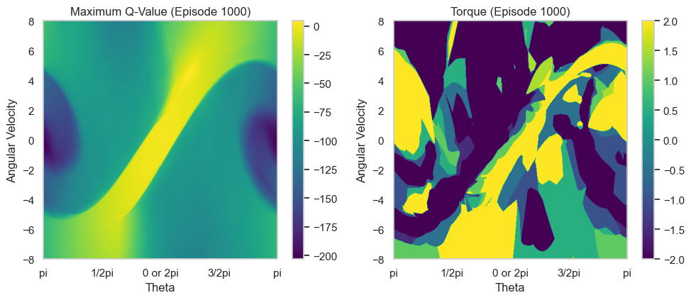

# Deep Q-Network (DQN) Implementation for Pendulum Task

This project implements a Deep Q-Network (DQN) and Double Deep Q-Network (DDQN) in PyTorch for solving the OpenAI Pendulum task. It was done as part of the Deep Learning module assignment at Singapore Polytechnic.

## Overview

The code includes implementations for both DQN and DDQN agents, along with a Q Network MLP (Multi-Layer Perceptron) for approximating the Q-values. The project uses the OpenAI Gym environment for the Pendulum task.

## Usage

1. Install the required dependencies:

    ```bash
    pip install -r requirements.txt
    ```
    
## Results


|Model|100-Episode Average (Total) Reward|
|---|---|
|DQN with Target (9 Actions, $\alpha=0.005$, $\gamma=0.98$) |$-137.71 \pm 6.80$|

Model weights are included.






## License

This project is licensed under the [MIT License](LICENSE).

## Acknowledgments

- Special thanks to [JM-Kim-94](https://github.com/JM-Kim-94/rl-pendulum) for providing inspiration and sharing code elements and logic. Some parts of this project were adapted from their work.

## Author

Glenn Wu

Feel free to contribute, report issues, or suggest improvements!
